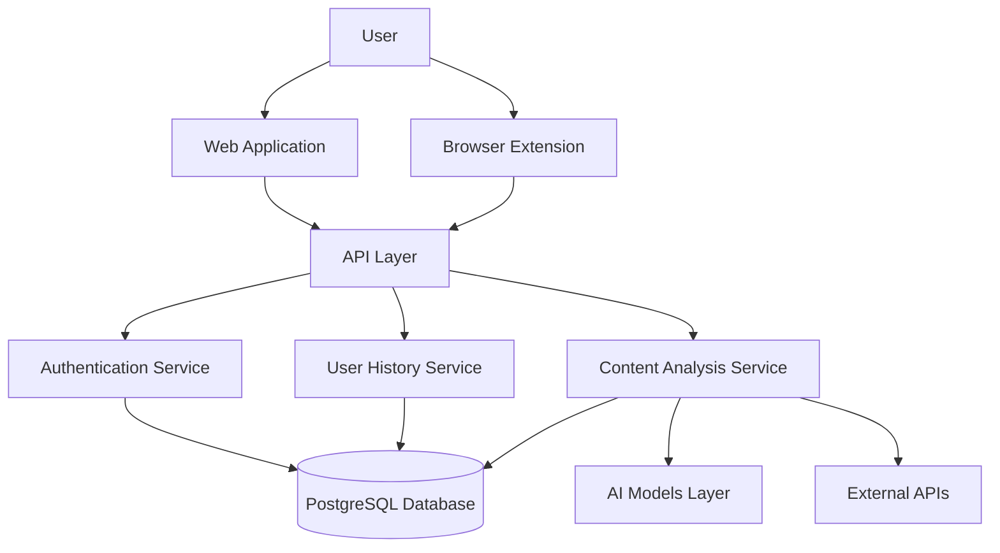

# Design Document

## Overview

FactShield AI is a full-stack application designed to detect and highlight misinformation in real-time. The system consists of a web application with a React frontend styled using Tailwind CSS v4, a Node.js/Express backend, a PostgreSQL database, and a Chrome browser extension. The platform leverages Hugging Face's NLP models to analyze content, extract claims, and assess their credibility.

This design document outlines the architecture, components, interfaces, data models, and implementation strategies for building FactShield AI.

## Architecture

The FactShield AI platform follows a modern full-stack architecture with the following key components:



### Key Components:

1. **Frontend Layer**
   - Web Application (React + Tailwind CSS v4)
   - Browser Extension (Chrome Extension with Manifest V3)

2. **API Layer**
   - RESTful API endpoints (Express.js)
   - WebSocket connections for real-time updates

3. **Service Layer**
   - Authentication Service
   - Content Analysis Service
   - User History Service

4. **Data Layer**
   - PostgreSQL Database
   - File Storage for uploaded documents

5. **AI Layer**
   - Hugging Face Transformers API integration
   - Local model hosting (optional)

6. **External Integrations**
   - News API
   - Fact-checking databases
   - PDF/text parsers

## Components and Interfaces

### 1. Web Application

The web application will be built using React.js and styled with Tailwind CSS v4. It will consist of the following key pages and components:

#### Pages:
- Landing Page
- Authentication Pages (Login/Register)
- Dashboard
- Content Analysis Page
- User History & Analytics
- Settings Page

#### Key Components:
- Navigation Bar
- Content Upload Widget
- URL Analysis Form
- Claim Extraction Display
- Fact-Check Results Card
- Analytics Charts
- Settings Panel

#### Tailwind CSS v4 Implementation:

The web application will leverage Tailwind CSS v4's new features:

1. **Installation and Setup**:
   ```css
   /* styles.css */
   @import 'tailwindcss';
   
   @theme {
     colors: {
       primary: '#4f46e5',
       secondary: '#10b981',
       warning: '#f59e0b',
       danger: '#ef4444',
       neutral: {
         50: '#f9fafb',
         900: '#111827'
       }
     },
     fontFamily: {
       sans: ['Inter var', 'sans-serif'],
       mono: ['JetBrains Mono', 'monospace']
     }
   }
   ```

2. **Dynamic Utility Values**:
   - Utilize dynamic spacing and grid utilities
   - Implement custom data attributes for interactive elements

3. **Container Queries**:
   - Use container queries for responsive components that adapt based on their container size rather than viewport

4. **3D Transforms and Animations**:
   - Implement subtle 3D effects for interactive elements
   - Use `@starting-style` for entrance animations

### 2. Browser Extension

The browser extension will be built using Chrome's Extension API with Manifest V3:

#### Key Components:
- Popup Interface
- Content Script for webpage analysis
- Background Service Worker
- Options Page

#### Features:
- Real-time content analysis
- Highlight suspicious claims on webpages
- Quick fact-check popup
- Synchronization with user account

### 3. Backend API

The backend will be built with Node.js and Express.js, providing RESTful endpoints:

#### Authentication Endpoints:
- `POST /api/auth/register` - User registration
- `POST /api/auth/login` - User login
- `POST /api/auth/refresh` - Refresh JWT token
- `POST /api/auth/logout` - User logout

#### Content Analysis Endpoints:
- `POST /api/analyze/url` - Analyze content from URL
- `POST /api/analyze/text` - Analyze raw text
- `POST /api/analyze/document` - Analyze uploaded document
- `GET /api/analyze/result/:id` - Get analysis results

#### User History Endpoints:
- `GET /api/history` - Get user's analysis history
- `GET /api/history/:id` - Get specific analysis details
- `DELETE /api/history/:id` - Delete history item
- `GET /api/analytics` - Get user's analytics data

#### Settings Endpoints:
- `GET /api/settings` - Get user settings
- `PUT /api/settings` - Update user settings

### 4. AI Analysis Service

The AI Analysis Service will handle the core fact-checking functionality:

#### Components:
- Claim Extraction Module
- Credibility Assessment Module
- Source Verification Module
- Translation Module

#### Integration with Hugging Face:
- Document Question Answering
- Text Classification
- Sentence Similarity
- Summarization
- Token Classification
- Translation

## Data Models

### User Model
```json
{
  "id": "uuid",
  "email": "string",
  "passwordHash": "string",
  "name": "string",
  "createdAt": "timestamp",
  "lastLogin": "timestamp",
  "settings": {
    "theme": "string",
    "notifications": "boolean",
    "privacyLevel": "enum"
  }
}
```

### Analysis Model
```json
{
  "id": "uuid",
  "userId": "uuid",
  "source": {
    "type": "enum", // url, text, document
    "content": "string", // URL or text content
    "documentId": "string" // If document uploaded
  },
  "status": "enum", // pending, completed, failed
  "createdAt": "timestamp",
  "completedAt": "timestamp",
  "results": {
    "summary": "string",
    "claims": [
      {
        "id": "string",
        "text": "string",
        "confidence": "number",
        "credibilityScore": "number",
        "sources": [
          {
            "url": "string",
            "title": "string",
            "reliability": "number"
          }
        ]
      }
    ]
  }
}
```

### Document Model
```json
{
  "id": "uuid",
  "userId": "uuid",
  "filename": "string",
  "fileType": "string",
  "fileSize": "number",
  "uploadedAt": "timestamp",
  "path": "string"
}
```

### History Model
```json
{
  "id": "uuid",
  "userId": "uuid",
  "analysisId": "uuid",
  "timestamp": "timestamp",
  "source": "string",
  "summary": "string"
}
```

## Error Handling

The application will implement a comprehensive error handling strategy:

1. **Frontend Error Handling**:
   - Form validation with real-time feedback
   - API error handling with user-friendly messages
   - Fallback UI components for failed data fetching

2. **Backend Error Handling**:
   - Centralized error middleware
   - Structured error responses with appropriate HTTP status codes
   - Logging and monitoring of errors

3. **AI Service Error Handling**:
   - Graceful degradation when models fail
   - Fallback to simpler models when advanced ones are unavailable
   - Clear communication of confidence levels in results

## Testing Strategy

### Frontend Testing:
- Unit tests for React components using Jest and React Testing Library
- Integration tests for page flows
- End-to-end tests using Cypress

### Backend Testing:
- Unit tests for service functions
- API endpoint tests
- Integration tests for database operations

### Extension Testing:
- Unit tests for extension components
- Manual testing across different websites
- Automated UI tests for popup interface

### AI Model Testing:
- Accuracy testing against known datasets
- Performance benchmarking
- A/B testing of different model configurations

## Security Considerations

1. **Authentication and Authorization**:
   - JWT-based authentication with secure token storage
   - Role-based access control
   - CSRF protection

2. **Data Protection**:
   - Encryption of sensitive data
   - Secure handling of uploaded documents
   - Privacy controls for user history

3. **API Security**:
   - Rate limiting
   - Input validation
   - API key management for external services

## Performance Optimization

1. **Frontend Performance**:
   - Tailwind CSS v4's improved performance
   - Code splitting and lazy loading
   - Optimized asset delivery

2. **Backend Performance**:
   - Caching strategies for frequent requests
   - Database query optimization
   - Horizontal scaling for API servers

3. **AI Performance**:
   - Model quantization where appropriate
   - Batch processing for document analysis
   - Caching of analysis results

## Deployment Strategy

The application will be deployed using a modern cloud infrastructure:

1. **Frontend Deployment**:
   - Static hosting for the React application
   - CDN for asset delivery
   - Chrome Web Store for extension distribution

2. **Backend Deployment**:
   - Containerized deployment using Docker
   - Orchestration with Kubernetes
   - CI/CD pipeline for automated deployments

3. **Database Deployment**:
   - Managed PostgreSQL service
   - Regular backups
   - Read replicas for scaling

4. **AI Model Deployment**:
   - Hugging Face Inference API for most models
   - Self-hosted models for sensitive operations
   - Model versioning and A/B testing